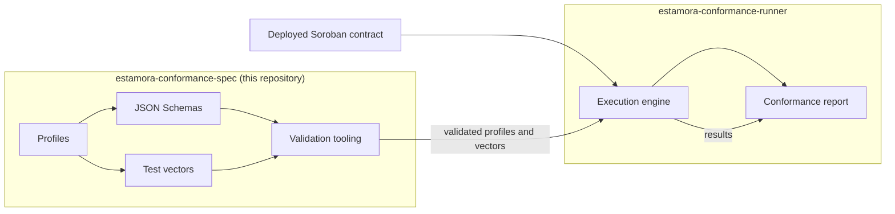
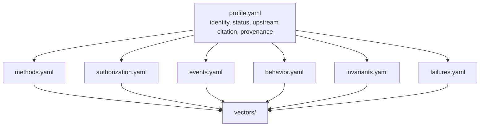

# estamora-conformance-spec

**The normative specification layer of Estamora: machine-readable definitions of what
it means for a Soroban smart contract to behave according to the standard it claims
to implement.**

This repository defines conformance. It does not measure it. Executing these
requirements against a deployed contract, and producing a result, belongs to
[`estamora-conformance-runner`](https://github.com/Estamora-Soroban-Layers/estamora-conformance-runner).
Estamora consists of exactly those two repositories.



## The question Estamora answers

> Does this Soroban contract actually behave according to the standard or interface
> profile it claims to implement?

Not: does it compile. Not: does it expose the expected methods. A contract can expose
all ten methods of the token interface with the exact expected signatures and still
lose user funds, because it never checked whose signature it received, or emits a
`transfer` event before validating the amount, or clamps an over-sized transfer instead
of rejecting it.

Interface compatibility is a _shape_ claim. Behavioural conformance is a claim about
what happens: which principal must authorize which call, which arguments their
authorization must cover, which events must be emitted and what they must say, what a
failed call must leave behind, and which properties must survive every call.

Estamora exists to make the second claim checkable.

## What is in this repository

| Path                           | What it holds                                                           |
| ------------------------------ | ----------------------------------------------------------------------- |
| `schema/`                      | The ten normative JSON Schemas, in JSON Schema draft 2020-12            |
| `profiles/<id>/<MAJOR.MINOR>/` | Released conformance profiles, as seven-document bundles                |
| `profiles/examples/`           | Complete worked example profiles, validated like any other              |
| `vectors/`                     | The shared vector library, including profile-independent scenarios      |
| `examples/`                    | Standalone example documents, one per schema                            |
| `scripts/`                     | Five validation entry points and the library they share                 |
| `tests/`                       | The Vitest suite: schema, profile, vector, layout and process contracts |
| `docs/`                        | The reference documentation, including the generated indexes            |
| `VERSIONING.md`                | The versioning policy this repository enforces on itself                |
| `CHANGELOG.md`                 | The release ledger, validated against the tree by `release-check`       |

## A profile is a bundle, not a document

A profile describes every requirement for one interface. It is seven documents, because
grouping the requirements by dimension is what makes them reviewable: a reviewer of
authorization should not have to read event structure to find the rules they are
checking.



The documents cross-reference each other by identifier, and the identifiers are the
namespace in which requirements are expressed:

- `methods.yaml` names the authorization rules, events, failures and behaviours that
  govern each method;
- `authorization.yaml` names the failure that must result from missing authorization
  and the failure that must result from the wrong actor, as two separate requirements;
- `behavior.yaml` names the invariants that must hold and the events that must, and must
  not, be emitted;
- `events.yaml` correlates an event with the invariant that checks what the event claims;
- `vectors/` turns requirements into cases with fixtures, inputs and expected outcomes.

A dangling reference is a defect, not a warning: a method that names an authorization
rule nobody declared is a requirement that is silently never enforced. Catching exactly
that class of defect is what `npm run validate:profiles` exists for.

### A method is more than a signature

```yaml
- id: transfer
  name: transfer
  requirement: required
  args:
    - name: from
      type: { kind: prim, name: address }
      authorization:
        required: true
        semantics: The address that must hold authorization for this invocation.
  returns:
    type: { kind: prim, name: void }
  mutability: mutating
  invocation: invoke
  authorization: [holder-authorizes-transfer]
  events: [transfer]
  failures: [transfer-beyond-balance]
  behaviors: [transfer-moves-value, transfer-without-authorization-fails]
```

Types are expressed in an interface-level vocabulary — `address`, `muxed_address`,
`i128`, `u128`, `vec`, `option`, `map`, `tuple`, `result`, `custom` — rather than in a
programming language's type system. A profile is not a Rust file, and a consumer in
another language must be able to read it.

## Authorization is a first-class dimension

The model distinguishes three outcomes that a single "did it fail" check collapses:

| Situation                                                         | Required outcome                  |
| ----------------------------------------------------------------- | --------------------------------- |
| The correct principal authorized the call                         | success                           |
| No authorization was presented                                    | **missing authorization** failure |
| Valid authorization was presented, belonging to another principal | **wrong actor** failure           |

The third case is the one that loses funds: a contract that verifies _a_ signature is
present without verifying _whose_ it is passes any test that only asks whether the
unauthorized call failed, because it does fail — for the wrong reason.

```yaml
- id: holder-authorizes-transfer
  methods: [transfer, burn]
  actor:
    kind: argument # the actor is an argument of the call
    argument: from
    on_behalf_of: false # the holder acts for itself
  coverage:
    mode: exact # the authorization must cover precisely these arguments
    arguments: [from]
  unauthorized: { kind: fail, failure: missing-transfer-authorization }
  wrong_actor: { kind: fail, failure: wrong-transfer-actor }
  replay_sensitive: false
```

`coverage` is explicit because "the caller authorized" is not the same claim as "the
caller's authorization covered the arguments that move value". A contract that checks a
signature over `from` but not over `amount` is distinguishable here and not in any
signature comparison.

## Events are evidence, not decoration

An event requirement states what must be emitted, with what structure, how many times,
in what order, and — where it matters — what the event's values must correspond to in
contract state.

```yaml
- id: transfer
  name: transfer
  requirement: required
  occurrence: on_success
  topics:
    - index: 0
      type: { kind: prim, name: symbol }
      binding: { kind: literal, value: transfer }
    - index: 1
      type: { kind: prim, name: address }
      binding: { kind: input, name: from }
  data:
    format: either # the profile accepts both documented encodings
    fields:
      - name: amount
        type: { kind: prim, name: i128 }
        binding: { kind: input, name: amount }
        optional: false
  cardinality: { min: 1, max: 1 }
  correlations: [balances-conserved-by-transfer]
```

The `correlation` is what makes an event checkable rather than merely well-formed: an
event that states an amount the balances disagree with is structurally valid, and is
caught only by tying the event to the invariant that measures the state it describes.

Failed operations carry the mirror requirement. A profile states that a rejected call
must emit **nothing**, because a contract that emits its success event before validating
its arguments tells every consumer that something happened which did not.

## Failure behaviour is stated semantically

Upstream specifications generally do not fix error codes, so a profile does not invent
them. It states the _semantic_ category and the required effect:

```yaml
- id: transfer-beyond-balance
  category: insufficient_balance
  methods: [transfer]
  trigger: The amount exceeds the sender's balance.
  expected:
    outcome: failure
    signal: either # trap, panic or host error are all acceptable
    state_effect: unchanged # no balance may move
    events_emitted: none # no transfer event may appear
  error_codes:
    policy: semantic_only # no specific payload is required
```

The categories — `insufficient_balance`, `unauthorized`, `wrong_actor`, `invalid_amount`,
`invalid_state`, `unsupported_operation`, `arithmetic_overflow` and others — are the
vocabulary a report can group by. Where an upstream specification _does_ fix codes, a
profile states `policy: exact_required` and names them.

## State assertions and invariants

A vector or a behavioural rule can assert an exact post-state, or a _relative_ one that
holds for every fixture, which is usually the honest form:

```yaml
postconditions:
  - kind: delta
    target:
      kind: read
      method: balance
      args: [{ kind: input, name: from }]
    direction: decrease
    by: { kind: input, name: amount }
```

Invariants are reusable, independently identifiable, and scoped — because "balances are
conserved" is true of a transfer and false of a mint, so an unscoped invariant would be
wrong for at least one operation in the profile. The vocabulary covers conservation
across a resource set, bounds evaluated per member, monotonicity, unchanged state, the
rule that a rejected caller cannot mutate protected state, and arbitrary predicates.

## Vectors are first-class specification artifacts

A requirement that has no vector is a requirement nobody has executed. Vectors live in
two places, and the distinction is part of the model:

- **the shared library**, `vectors/<set>/<operation>/`, holds cases every profile of a
  family consumes. `vectors/common/` holds profile-independent scenarios declared
  against the wildcard profile, so a requirement that holds for every fungible token is
  stated once instead of restated — and possibly softened — in each profile;
- **a profile bundle's own `vectors/`** holds cases that exist because of a decision
  pinned to that exact profile version.

Negative vectors are mandatory. A suite of only successful calls cannot establish
behavioural conformance, and `npm run validate:vectors` fails the build for a profile
that has none.

```yaml
id: transfer-beyond-balance-fails
profile: sep-41
profile_version: "1.0"
kind: negative
method: transfer
fixtures:
  actors: [{ name: alice, kind: account, ref: common/addresses/alice }]
  balances: { alice: "100" }
  authorization: { alice: true }
inputs:
  from: { kind: actor, ref: alice }
  to: { kind: actor, ref: bob }
  amount: { kind: literal, value: "250" }
expected:
  outcome: failure
  failure: transfer-beyond-balance
  state_assertions:
    - id: sender-unchanged
      description: A rejected transfer must leave the sender's balance untouched.
      resource: { kind: balance, account: alice }
      predicate:
        kind: unchanged
        target: { kind: read, method: balance, args: [{ kind: actor, ref: alice }] }
  events: { required: [], forbidden: [transfer] }
```

## How the runner consumes this repository

The specification is designed to be consumed without undocumented assumptions:

1. **Load** a profile by identity, `profiles/<id>/<MAJOR.MINOR>/`, or by an explicit path.
2. **Validate** it against `schema/*.schema.json`. A profile that does not validate must
   not be executed: `PROFILE_ERROR` is not `NON_CONFORMANT`.
3. **Resolve** the vectors the bundle owns plus the shared sets it declares in
   `includes.shared_vectors`.
4. **Digest** the canonical form of every document. Digests are computed over canonical
   JSON, so they are identical on any machine, which is what lets a conformance receipt
   name an exact revision of the requirements.
5. **Execute** each vector and evaluate every assertion the profile and the vector state.
6. **Report** per-assertion results using the taxonomy in `schema/report.schema.json`,
   whose statuses — `CONFORMANT`, `PARTIALLY_CONFORMANT`, `NON_CONFORMANT`,
   `INCONCLUSIVE`, `EXECUTION_ERROR`, `PROFILE_ERROR` — are collapsed into a single
   boolean nowhere.

The runner is a separate repository and can be replaced. Nothing in the specification
format depends on it.

## Using this repository

Requires Node.js 22.12 or later.

```bash
npm ci

npm run validate:schemas    # every schema is a valid draft-2020-12 schema and compiles
npm run validate:profiles   # every bundle agrees with itself and with the shared library
npm run validate:vectors    # the corpus is internally consistent and covers the dimensions
npm run release:check       # the tree is releasable: version, ledger, no placeholders
npm run docs:check          # the committed reference indexes are current
npm test                    # the full suite

npm run ci                  # all of the above, in CI order
```

Every entry point accepts `--json` and exits with a code that distinguishes the
outcome:

| Exit code | Meaning                                                  |
| --------- | -------------------------------------------------------- |
| `0`       | Every checked artifact is valid                          |
| `1`       | At least one defect was found                            |
| `2`       | The tooling itself failed, or the command line was wrong |

`2` never means "a contract is non-conformant". CI and the runner depend on that
distinction, which is why it is a tested contract rather than a convention.

## Authoring a profile

1. Read [`docs/profile-authoring.md`](docs/profile-authoring.md) and
   [`VERSIONING.md`](VERSIONING.md).
2. Copy `profiles/sep-41/1.0/` as a starting point, or a worked example from
   `profiles/examples/` if you want something smaller.
3. Take requirements from a documented source. Do not invent them, and do not
   paraphrase an upstream statement into something it does not say.
4. Record every reading you had to choose in `provenance.interpretation_notes`. The
   schema requires that list to be non-empty: a profile must not be silent about where
   it interpreted.
5. Add vectors, including at least one negative case per profile and one for each
   dimension. A profile's vectors belong to the profile's version.
6. Run `npm run validate` and `npm test`. Then open a
   [profile proposal](.github/ISSUE_TEMPLATE/profile-proposal.yml) describing the
   upstream revision, the dimensions covered, the ambiguities and the negative cases.

If a change alters what an existing profile requires, it is a new version, not an edit —
see [`VERSIONING.md`](VERSIONING.md). The rule is mechanical: _any change that alters
what a profile requires is a version change_, including changes that look small.

## Contributing

[`CONTRIBUTING.md`](CONTRIBUTING.md) covers the architecture, the profile lifecycle, how
to run validation locally, how requirements are reviewed, and how breaking changes are
handled. [`GOVERNANCE.md`](GOVERNANCE.md) covers who decides what, and how a profile is
promoted from `draft` to `stable`.

## What Estamora does not do

- **Conformance is not security.** Passing a profile means a contract behaves as the
  profile defines. Profiles are written by people, and a profile that misses a failure
  mode does not detect it. Estamora does not replace formal verification, a security
  audit, penetration testing, economic analysis or vulnerability research, and it must
  never be presented as doing so.
- **A profile is not a trusted standard because it exists in this repository.** Profile
  provenance matters. Anyone may propose a profile, and a profile has authority only
  over the requirements it states.
- **Version pinning matters.** A conformance result names a profile identity such as
  `sep-41@1.0`. A result that names only `sep-41` is incomplete.
- **This repository does not execute anything against a contract.** It defines
  requirements. It never claims a contract is conformant; the runner measures that, and
  its report is the artifact that carries the claim.

[`SECURITY.md`](SECURITY.md) states these limits in full, including how to report a
defect in the specification itself.

## License

Apache-2.0. See [`LICENSE`](LICENSE).
