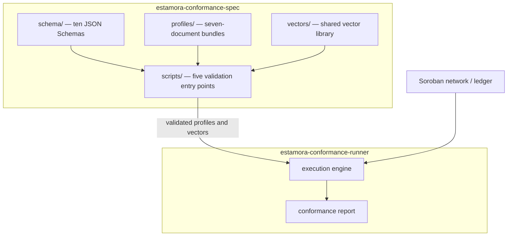
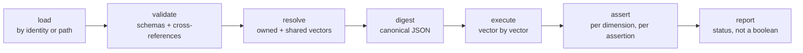

# Architecture

## Two repositories, one boundary

The boundary is deliberate and must not move. This repository defines **what conformance
means**; the runner determines **whether a contract meets that definition**. Moving
execution here would make the specification depend on one implementation, and moving
requirements into the runner would make the normative documents unreadable to anything
else.

This has a practical consequence: the specification format is designed so that a
completely independent implementation can consume it. Nothing in `schema/`, `profiles/` or
`vectors/` references the runner, and the runner is replaceable.

## Layers

### 1. Normative specification — `profiles/`, `vectors/`

The requirements themselves. These are the documents a reviewer reads and a consumer
obeys. Everything else exists to constrain, validate, or describe them.

### 2. Machine-readable schemas — `schema/`

Ten JSON Schemas, targeting draft 2020-12. Each rejects unknown properties, so an
undeclared requirement cannot be smuggled into a profile without a schema change. They
are the format's public contract: any validator, in any language, can load them.

| Schema                      | Constrains                                                                          |
| --------------------------- | ----------------------------------------------------------------------------------- |
| `profile.schema.json`       | Profile metadata, upstream citation, compatibility, provenance, the bundle manifest |
| `method.schema.json`        | Methods, argument and return types, mutability, invocation mode, requirement lists  |
| `authorization.schema.json` | Authorization rules: actor, argument coverage, rejection routes, replay sensitivity |
| `event.schema.json`         | Events: topics, payload, bindings, cardinality, ordering, correlations              |
| `behavior.schema.json`      | Preconditions, postconditions, expected and forbidden events and failures           |
| `invariant.schema.json`     | Invariant kinds, scope, resource sets, per-kind conditional requirements            |
| `failure.schema.json`       | Failure categories, triggers, expected signal and state effect, error-code policy   |
| `vector.schema.json`        | Fixtures, inputs, authorization plan, expected outcome, state assertions, events    |
| `assertion.schema.json`     | The predicate and value-expression vocabulary shared by all of the above            |
| `report.schema.json`        | The conformance report produced by the runner                                       |

### 3. Test vectors — `vectors/`, `profiles/*/*/vectors/`

Vectors live in two places, and the distinction is part of the model rather than an
accident of layout:

- the **shared library** `vectors/<set>/<operation>/` holds cases every profile of a
  family consumes. `vectors/common/` holds profile-independent scenarios declared against
  the wildcard profile `*`, so a requirement that holds for every fungible token is
  written once rather than restated — and possibly softened — in each profile;
- a **bundle's own** `vectors/<operation>/` holds cases that exist because of a decision
  pinned to that exact profile version.

### 4. Validation tooling — `scripts/`

Four independent layers, deliberately split because they answer different questions and
fail in different ways:

| Entry point            | Question                                                                                           |
| ---------------------- | -------------------------------------------------------------------------------------------------- |
| `validate-schema.ts`   | Is each schema a valid draft-2020-12 schema, and does it compile under strict mode?                |
| `validate-profiles.ts` | Do a bundle's documents agree with each other, with the shared library, and with the layout rules? |
| `check-vectors.ts`     | Is the vector corpus internally consistent, and does it cover the conformance dimensions?          |
| `generate-docs.ts`     | Do the committed reference indexes match the generated ones?                                       |
| `release-check.ts`     | Is this tree releasable: version, ledger, placeholders, license, documentation?                    |

Each accepts `--json` and exits `0` for a valid tree, `1` for a defective one, `2` when
the tooling itself failed. That taxonomy is a tested contract, because a CI job that
cannot tell a broken profile from a broken workflow will eventually report an
infrastructure failure as a non-conformant contract.

### 5. Documentation — `docs/`, `docs/generated/`

Prose explains intent; `docs/generated/` is machine-written from the profiles and
vectors, so it cannot drift silently. `generate-docs.ts --check` fails the build when the
committed output is stale.

### 6. Governance and versioning — `VERSIONING.md`, `GOVERNANCE.md`

Versions and statuses are part of the interface: a conformance result names a profile
identity, and a status makes a claim about review. Both are enforced mechanically where
they can be, and stated normatively where they cannot.

## What validation cannot see

JSON Schema answers "is this document shaped correctly". It cannot see that a method
names an authorization rule nobody declared, or that a vector's inputs disagree with the
signature it tests. Those defects are the dangerous ones, because a profile with a
dangling reference looks complete while enforcing less than it appears to.

That is the entire reason the cross-reference validator is separate from the schema
validator, and why a bundle whose documents fail schema validation is reported as
"cross-reference checks skipped" rather than producing forty derivative errors that bury
the one schema error that matters.

## How the runner consumes this repository

Each step is a documented contract, not an assumption. The canonical digest is what lets
a conformance receipt name an exact revision of the requirements it was measured against,
and the report model's statuses — `CONFORMANT`, `PARTIALLY_CONFORMANT`, `NON_CONFORMANT`,
`INCONCLUSIVE`, `EXECUTION_ERROR`, `PROFILE_ERROR` — are collapsed into a single boolean
nowhere, because "the contract failed" and "the profile was malformed" are not the same
finding and must not be reported as though they were.

## Layout invariants

The layout is part of the public interface: the runner resolves
`schema/<name>.schema.json`, `profiles/<id>/<MAJOR.MINOR>/` and
`vectors/<set>/<operation>/` without being told where to look.

- a profile bundle is exactly seven documents plus a `vectors/` directory;
- a released profile lives at `profiles/<id>/<MAJOR.MINOR>/`;
- an example profile is flat, `profiles/examples/<name>/`, because an example is a
  worked illustration rather than a released requirement set and forcing a version
  directory would suggest a release that does not exist;
- shared vectors are exactly two levels deep.

These are enforced by `tests/profiles/layout.test.ts`, so a structural change fails a test
rather than a consumer.
